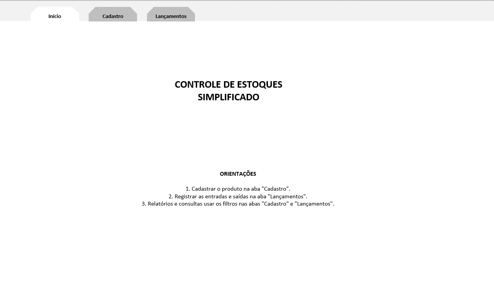

# 📦 Projeto: Controle de Estoque em Excel

Este projeto consiste em um conjunto de **planilhas em Excel** desenvolvidas para o **gerenciamento de estoque de produtos**, com registro de entradas, saídas e controle automático de níveis mínimos e máximos.  
O objetivo é facilitar o acompanhamento de materiais em tempo real, evitando rupturas e excessos de estoque.

## 📊 Estrutura do Projeto

O projeto é composto por **três planilhas principais**:

| Planilha | Descrição |
|-----------|------------|
| **Início** | Tela inicial do sistema, podendo conter atalhos e visão geral do estoque. |
| **Cadastro** | Registro de todos os produtos com campos de medida, estoque mínimo, máximo, saldo e alertas automáticos. |
| **Lançamentos** | Controle diário de movimentações (entradas e saídas), com atualização automática do saldo disponível. |

## 🧠 Conceitos Aplicados

- **Automação com fórmulas de célula** para cálculo de saldo e alertas de reabastecimento  
- Uso de **referências absolutas e relativas** entre planilhas  
- Aplicação de **formatação condicional** para avisos de estoque baixo  
- Organização de dados com **tabelas estruturadas e filtros dinâmicos**  
- Separação lógica entre **cadastro, lançamentos e visualização principal**

## 📈 Resultados Esperados

- Sistema de controle de estoque **automatizado e confiável**  
- Avisos visuais de **“Solicitar nova compra!”** quando o saldo estiver abaixo do mínimo  
- Histórico de movimentações completo, facilitando auditoria e replanejamento de compras  
- Interface simples e padronizada para uso profissional

## 💡 Tecnologias Utilizadas

- **Microsoft Excel**  
- **Fórmulas de célula e funções condicionais (SE, SOMA, PROCV, etc.)**  
- **Formatação condicional e estilos personalizados**  
- **Organização modular em planilhas integradas**

## 🧑‍💻 Autores

Projeto desenvolvido durante o curso:

> **Curso Excel COMPLETO – Do básico ao avançado**  
> Professores: [Prof. Dr. Nélio Alves](http://educandoweb.com.br) e Prof. Me. Bruno Arantes

## 🚀 Visualização

  
  
  

