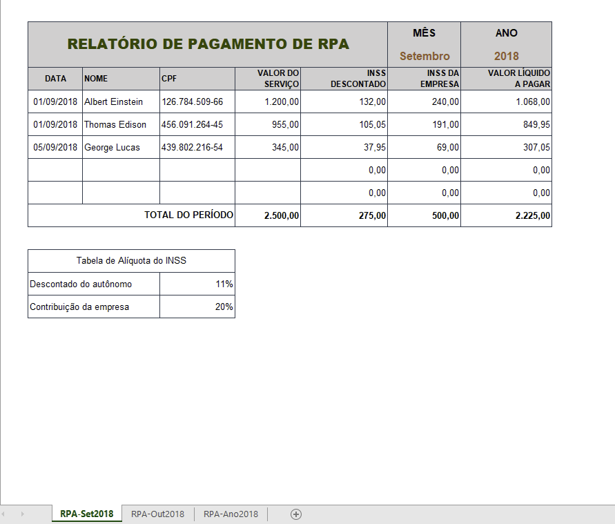
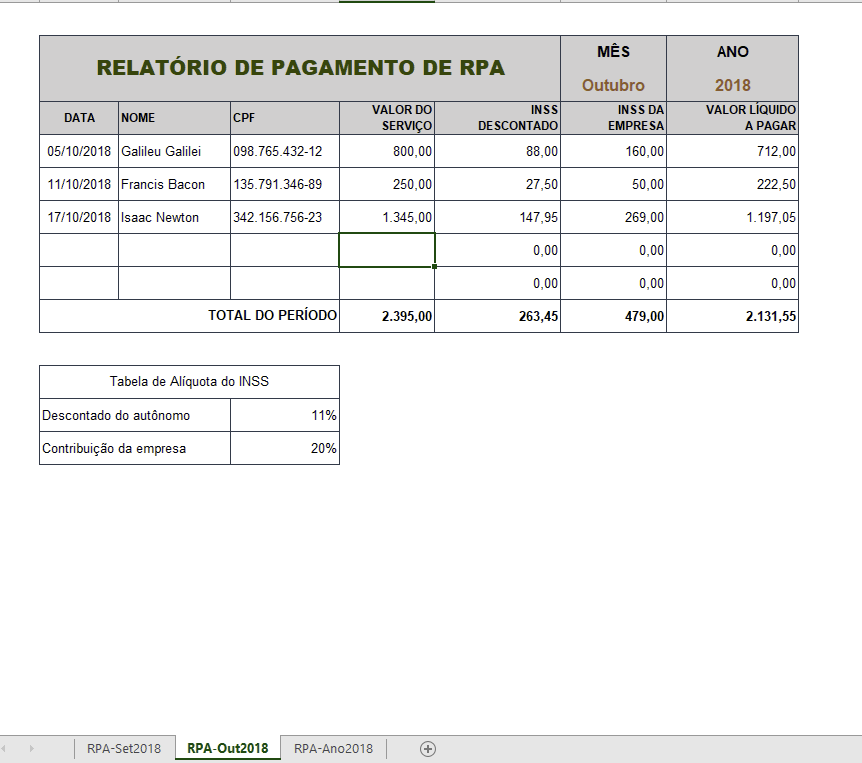
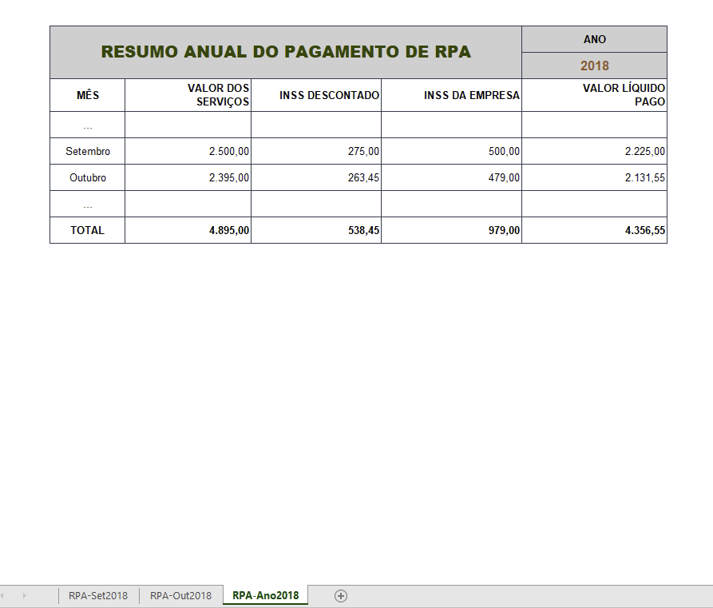

# 🧾 Projeto: Recibo de Pagamento Autônomo (RPA)

Este projeto consiste em um conjunto de **planilhas em Excel** desenvolvidas para gerenciar o **pagamento mensal de serviços prestados por autônomos** (RPA – *Recibo de Pagamento a Autônomo*).  
O objetivo é facilitar o controle de valores brutos, descontos de INSS e valores líquidos a pagar, além de oferecer uma visão consolidada anual.

## 📊 Estrutura do Projeto

O projeto é composto por **três planilhas principais**:

| Planilha | Descrição |
|-----------|------------|
| **RPA-Set2018** | Controle dos pagamentos do mês de setembro de 2018. |
| **RPA-Out2018** | Controle dos pagamentos do mês de outubro de 2018. |
| **RPA-Ano2018** | Consolidação dos valores anuais com totais e somatórios automáticos. |

---

## 🧠 Conceitos Aplicados

- Formatação profissional de planilhas no Excel  
- Uso de **fórmulas com referências absolutas e relativas**  
- **Função SOMA** e **referências entre planilhas**  
- Controle e cálculo de **INSS Descontado** e **INSS da Empresa**  
- **Consolidação de dados mensais** em um relatório anual

## 📈 Resultados Esperados

- Planilhas organizadas e com **fórmulas automatizadas**.  
- Relatório anual consolidado com **totais de serviços, descontos e contribuições**.  
- Visual limpo e padronizado para uso profissional.

## 💡 Tecnologias Utilizadas

- **Microsoft Excel**
- **Fórmulas de célula** (referências absolutas e relativas)
- **Formatação condicional e estilos personalizados**

## 🧑‍💻 Autores

Projeto desenvolvido durante o curso:

> **Curso Excel COMPLETO – Do básico ao avançado**  
> Professores: [Prof. Dr. Nélio Alves](http://educandoweb.com.br) e Prof. Me. Bruno Arantes

## 🚀 Visualização

  
  
  

